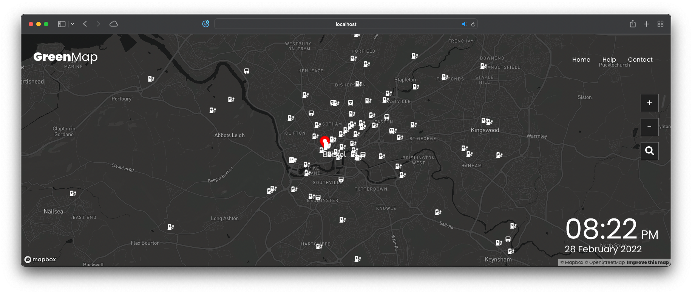

# 1. GreenMap

This repository stores the project created for the [University of Bristol CSSxBoeing Hackathon 2022][1].

**UPDATE: We are very happy to share that this project received an honourary mention in the event!**

- [1. GreenMap](#1-greenmap)
  - [1.1. About the hackathon](#11-about-the-hackathon)
  - [1.2. Our Team](#12-our-team)
  - [1.3. Our Project](#13-our-project)
  - [1.4. Tech Stack](#14-tech-stack)
  - [1.5. Deployment](#15-deployment)
    - [1.5.1. Requirements](#151-requirements)
    - [Development](#development)
    - [Deployment](#deployment)
    - [1.5.2. Creating the compose network](#152-creating-the-compose-network)
  - [1.6. Usage](#16-usage)

---

## 1.1. About the hackathon

The CSSxBoeing Hackathon is a 24-hour hackathon that is open to all courses and years of students in the University of Bristol.

The theme for 2022 is **Sustainable Cities and Communities 🏢🏠**.

---

## 1.2. Our Team

Called Rogue One, the team consists of 6 students from the University of Bristol:

- [Mitch Lui][2] (Computer Science, 2nd Year)
- [Salman Khan][3] (Computer Science, 2nd Year)
- [Artur Varosyan][4] (Computer Science, 2nd Year)
- [Matthew Swann][5] (Computer Science, 2nd Year)
- [Otis Lee][6] (Electrical and Electronic Engineering, 2nd Year)
- [Samuel Cheung][7] (Electrical and Electronic Engineering, 2nd Year)

---

## 1.3. Our Project

We created a Google-Map like application that allows users to search for a location and then view the weather and traffic information for that location, but specically for methods that promotes sustainable shared mobility and transport e.g. e-scooters.



The data is provided by different 3rd party APIs (credited below), and the navigation algorithm is written from scratch that uses a clustering method (we decided to name it G-Cluster).

3rd Party APIs include:

- Voi
- Tier
- Santander
- Electric Vehicles
- Transport API

--- 

## 1.4. Tech Stack

**Application**: Docker Compose

**Frontend**: React + MapBox API

**Backend**: FastAPI

---

## 1.5. Deployment

### 1.5.1. Requirements

Before reading instructions for development and deployment, a .env file under `server/routers/internal` is required.

A sample .env file can be found in the directory. 

### Development

Install:

- frontend dependencies by running `npm install` in `frontend` directory
- backend dependencies by running `pip install -r requirements.txt` in `server` directory

### Deployment

Install:

- Docker (and Compose)


### 1.5.2. Creating the compose network

Run this shell script:

```sh
./make_compose.sh
```

This creates a compose network with 2 containers:

- `frontend` with assigned port 8080
- `backend` with assigned port 5001

---

## 1.6. Usage

To be added

---

[1]:https://cssbristol.co.uk/events/2022-02-26_boeing_hackathon/
[2]:https://github.com/mitchLui
[3]:https://github.com/m-salmankhan
[4]:https://github.com/artur-varosyan
[5]:https://github.com/matthewjackswann
[6]:https://www.linkedin.com/in/otis-lee/
[7]:mailto:jm20101@bristol.ac.uk